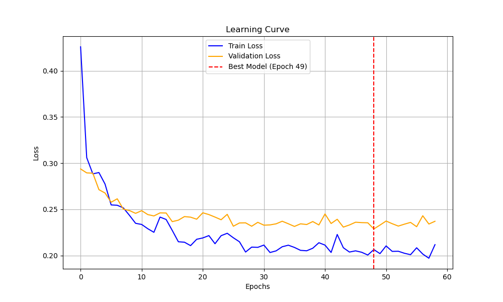
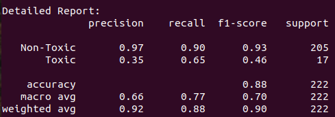
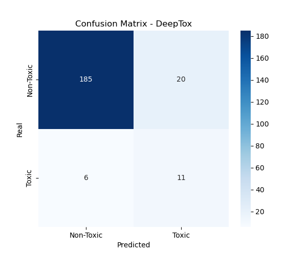

# DeepTox: Modelado Predictivo de Toxicidad Clínica mediante Deep Learning

---

## 1. Resumen Ejecutivo y definición del problema

Este proyecto trata de **farmacovigilancia predictiva**. En el desarrollo de fármacos y medicamentos, muchos fallan ya que resultan ser dañinos y y tóxicos para el cuerpo humano en el momento que se llega a la fase clínica de pruebas con personas. El análisis tratará de una **clasificación binaria**:

- **Clase 0:** el fármaco superó los ensayos clínicos (es seguro)
- **Clase 1:** el fármaco no superó los ensayos clínicos (es tóxico)

El modelo deberá de aprender de una nueva molécula y decidir la probabilidad de toxicidad.

---

## 2. Orden de implementación

Seguiremos este orden de trabajo:

1. `data_loader.py`: leeremos los datos y los transformaremos.
2. `model.py`: definiremos la estructura de nuestra red neuronal (capas, neuronas, ReLUs...)
3. `train.py`: unimos data_loader y model.py para crear un bucle de entrenamiento y hacer que la red aprenda.
4. `evaluate.py`: tras entrenar el modelo, evaluaremos el modelo para datos desconocidos.

---

## 3. Especificaciones del Dataset

El dataset como podemos ver contiene simbología extraña. Esto se denomina **SMILES**.
Los ordenadores no saben ver imagenes de moléculas 3D, por lo tanto los químicos inventaron este lenguaje de texto para representar estructuras.

- Las letras son átomos (`C` es carbono, `O` es oxígeno)
- Los números representan dónde se cierran los anillos
- Los símbolos como `=` o `#` represetan enlaces dobles o triples

El problema es que las redes neuronales no entienden estos textos SMILES, por ello en `data_loader` usaremos **RDKit** para convertir este texto en un vector de números (ceros y unos) llamado **Morgan Fingerprint**. Diríamos que es como el DNI numérico de la molécula.

Estos datos son compuestos químicos reales extraidos de ensayos clínicos de la FDA estadounidense.
Abarca moléculas pequeñas como la aspirina y el paracetamol que han sido testeadas en humanos.

Cada fila del dataset es un experimento histórico. Por lo tanto, usaremos décadas de investigación médica para entrenar un modelo que pueda predecir el futuro de nuevas medicinas.

Como podeis ver, el dataset está compuesto por 3 columnas:

1. `smiles`: lo que ya hemos comentado, la cadena de texto que representa la estructura de la molécula.
2. `FDA_APPROVED`: indica si la molécula fue aprobada por la FDA o no.
3. `CT_TOX`: indica si la molécula falló específicamente por toxicidad en ensayos clínicos. **Esta será nuestra etiqueta objetivo.**

---

## 4. Conclusiones y Análisis

> **NOS ENFRENTAMOS A UN GRAN PROBLEMA:**

En ClinTox, la gran mayoría de las filas son de **clase 0**. Hay muy pocas moléculas identificadas como tóxicas (clase 1).
Esto puede hacer que el modelo de clase 0 siempre, obtenga un éxito del 90%.
De este modo, tendremos que usar métricas como **precision-recall** o el **AUC-ROC** para demostrar que nuestro modelo realmente indentifica los casos tóxicos y no solo está adivinando lo más frecuente.

---

## 5. Requisitos Técnicos

| Dependencia | Uso |
|-------------|-----|
| Python 3.x | Lenguaje base |
| PyTorch | Red neuronal |
| RDKit | Procesamiento de moléculas (SMILES → Morgan Fingerprint) |
| Pandas | Manejo del dataset |
| NumPy | Operaciones numéricas |
| Scikit-Learn | Métricas de evaluación |
| Matplotlib | Visualización de curvas |
| Streamlit | Interfaz de usuario |

Se han especificado todas las dependencias y requisitos técnicos necesarios en `requirements.txt`.

---

## 6. Análisis técnico y Decisiones de Arquitectura

Para el desarrollo del modelo, he optado por la **herencia de la clase `nn.Module`** en lugar de utilizar `nn.Sequential`.
Es decir, en lugar de usar una lista de capas automáticas (que es lo más fácil), es preferible construirlo manualmente usando esta clase.
Al hacerlo de esta forma se puede **intervenir en cualquier punto del forward**. Esto es imorescindible si en el futuro queremos añadir conexiones más complejas o extraer información de capas intermedias para saber qué está aprendiendo el modelo.
También es más sencillo encontrar errores en las dimensiones de los tensores de esta forma.

### Álgebra lineal en PyTorch

Cuando estudiamos las Fully connected matemáticamente usando álgebra lineal, solemos utilizar `z = W x + b`, sin embargo Pytorch funciona como `z = x W^T + b`.
Realmente esto no afecta ya que siempre `in_features -> out_features`.

### Función de activación

Utilizamos **relu** como función de activación para darle complejidad a la curva y quitarle linealidad.

### Función de pérdida y logits

En la función forward **no aplicamos la funcion de activación de salida** y nos quedamos con el logit porque más tarde, al usar el BCE (binary Cross Entropy), este utilizará los logits y el mismo aplicará Sigmoid internamente (`nn.BCEWithLogitsLoss`). Podríamos utilizar `nn.BCELoss` (en el cual ya hemos tenido que aplicar sigmoid en `model.py`), pero este tiene más riesgo ya que si el logit es muy grande o muy pequeño el logaritmo de la función de pérdida puede divergir por lo que nos saldrá un valor de Error. **`BCEWithLogitsLoss` usa una fórmula simplificada para evitar los infinitos.**

En pytorch, al utilizar la BCE directamente usa sigmoid, ya que está conectado matemáticamente (obviamente).
Si tuvieramos variaas clases de salida (categorical cross entropy) la función ya no sería BCE sino **`CrossEntropyLoss` (CCE)**.

### Hiperparámetros y Early Stopping

Como se observa en los hiperparámetros establezco muchos epochs ya qeu el **early stopping** parará cuando sea necesario.

Utilizamos **Adam** para el optimizador ya que de esta forma tendremos un **learning rate adaptativo**, y un **momentum** que le proporcionará inercia al modelo.

### Gestión de tensores

Debemos utilizar el método **`squeeze()`** ya que tenemos que eliminar la dimensión 1 del tensor de salida tras el forward, ya que por lo general las funciones de périda usan una `shape(x,)` en vez de `shape(x,1)`.

### Gradientes y parámetros

Cada vez que ejecutamos el backward respecto de loss, se guardan todas estas pendientes (gradientes) en los parametros almacenados del modelo `model.parameters()`.
En `model.parameters()` están contenidos los **pesos** y **bias**. Cada peso y cada bias contienen:

1. `.data`: valor actual del peso
2. `.grad`: donde se almacena el gradiente

Tras el backward estos `.grad` no se sobreescriben, sino que **se suman al gradiente anterior** de este peso. Como no queremos eso, antes hemo llevado los gradientes a 0 con `optmizer.zero_grad()`.
Podemos pensar que lo ideal sería hacer `model.parameters().zero_grad()`, que es lo que haría yo. Pero tras investigar, aprendemos que es más óptimoo aplicar el método a optimizer ya que modificamos solo los gradientes de los parametros que el optimizador controla en este caso.

En cambio, el valor de los pesos **SÍ que se sobreescribe** tras el `optimizer.step()` a si que e este caso no hay que inicializarlos a cero.

Hemos de añadir que el valore de loss no es un simple float, sino un **tensor de un único elemento**. Este valor al ser un tensor va a estar conectado al modelo, sus parámetros, probablemente una GPU... por lo tanto, utilizamos **`loss.item()`** para hacernos con ese float.

---

## Iteraciones del modelo

### Primera prueba

La primera prueba de la red en el test de evaluación nos ha dado un **overfitting bastante alto**. Había utilizado un dropout de 0.3 y 4 layers de neuronas.
En esta primera prueba también hemos identificado que **6 de las moléculas del dataset estaban mal dibujadas o eran erróneas**, por lo que las hemos limpiado y eliminado del csv.

### Segunda prueba

Para la segunda prueba he subido el dropout a **0.5** y he disminuido el número de capas a **dos hidden layers y una capa de salida**.
También he añadido **`weight_decay`** en `nn.Adam` para ayudar a disminuir el overfitting. El weight decay funciona penalizando o el valor absoluto de los pesos en la función de pérdida, o el cuadrado de los pesos. Esto sirve para que los pesos no aprendan demasiado.

Gracias a utilizar menos nueronas, menos capas, y un weight decay alto (0.05), acabamos de conseguir una **convergencia suave y un overfitting prácticamente nulo**. Bingo!!

Probando con **tanh** en vez de reLU, los resultados son ligeramente mejores.

### Resultado final

Finalmente hemos bajado el número de neuronas, y los resultados son aún mejores, demostrando que para un dataset pequeño como es el caso, **una red más sencilla siempre va a ser mejor**:

```python
self.fc1 = nn.Linear(input_size, 150)
self.fc2 = nn.Linear(150, 40)
self.out = nn.Linear(40, 1)
self.dropout = nn.Dropout(p = 0.5)
```

```
Epoch [049/100] | Train Loss: 0.2064 | Val Loss: 0.2288
```

---

## Curva de aprendizaje



---

## Evaluación del modelo

Generamos un script `evaluate.py` donde instanciamos el modelo y cargamos los mejores parámetros generados en el entrenamiento. Si hiciéramos esta validación final en el mismo script de train al final, estaríamos entrenando con los pesos de la época 59. Al hacerlo desde otro script cargando el mejor modelo, lo hacemos con la **época 49 (la mejor)**.

---

## Métricas y umbral de decisión

En cuanto a las métricas, en el descubrimiento de fármacos preferimos un **AUC-ROC alto** porque nos asegura que, aunque el modelo no sea perfecto, está ordenando las moléculas corréctamente por su nivel de riesgo.

He selccionado un **umbral de 0.15** sobre la predicción ya que esto ayuda a identificar las verdaderas moléculas tóxicas. Si subimos ese umbral a 0.5, no se identifica prácticamente ninguna molécula tóxica debido a que es un dataset muy desbalanceado y tenemos muy pocas moléculas tóxicas, entonces el modelo aprende que si siempre se dice que no es tóxica, este va a tener un accuracy mucho más alto.

En farmacoloǵia, si predecimos que una molécula es tóxica aunque realmente no lo sea, no es malo ya que preferimos que identifique moléculas como tóxicas pero que no lo son, que moléculas como no tóxicas cuando sí que lo son, ya que una molécula que se predice como tóxica se puede volver a estudiar más a fondo, pero lo que no es una posibilidad es dejar pasar moléculas tóxicas desapercibidas. Dicho esto, el objetivo es encontrar un **recall lo más alto posible**, pero un **trade-off balanceado**. Tampoco queremos identificar muchas moléculas no tóxicas como tóxicas.



---

## Matriz de confusión


